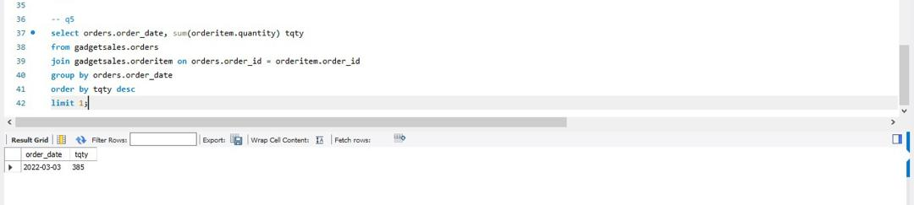

# GADGETSALES-USING-SQL

## INTRODUCTION
Mr. Chinedu, the owner of a gadget shop, Approached me for assistance in addressing vital questions regarding his business. Recognizing the value of my skills, Mr. Chinedu has granted me access to a database file called "GadgetSales.sql," which encompasses crucial data tables such as consumer, orders, order items, and products. I have already imported this database, ready to leverage its information for insightful analysis. My role as a data analyst will now play a pivotal part in unraveling valuable insights that will aid Mr. Chinedu in making informed decisions and optimizing his business operations.

## GADGET SALES
1. Which device had the most sales by quantity?
2. Which device had the lowest sales by quantity?
3. Top 3 most expensive gadgets.
4. Top 3 customer names that spent the most. (Hint: Sum of product of price and quantity)
5. Which order date did the least quantity of gadget sold?
6. Which customer name had the most orders by quantity?
7. List 3 devices with the lowest sales by quantity.
8. On which order date did “iPad Pro” had the most sales by quantity?
9. Which customer name bought “iPhone 13” the most by quantity?
10. Between the cheapest device and the most expensive device, which had more quantity 
sold? And why is the result so??

## INSIGHT
1. The device which had the most sales by quantity is,Pro HERO10 Black

2. The device which had the least sales by quantity is, Logitech MX Master3 

3. The Top 3 most expensive gadgets are; Canon EOS R6, Sony Alpha a7111, LG OLED C1 Series

4. The Top 3 customer names that spent the most are; Maria Rodriguez, Brian Davis, Jacob Chen
 
5. The order with date which had the least quantity of gadget sold; 

6. The customer whose name had the most orders by quantity is; Megan Smith

7. The top 3 devices with the lowest sales by quantity are 
 
8. The order date which “iPad Pro” had the most sales by quantity
 
9. The customer with name that bought “iPhone 13” the most by quantity
 
10. Between the cheapest device and the most expensive device, the one with more quantity 
sold are

The Canon EOS R6 likely offers advanced features and superior performance compared to other cameras in its price range. This could attract professional photographers or enthusiasts who value the camera's capabilities and are willing to pay a premium for them.
## CONCLUSION
After analyzing the order and order item tables, you can determine the overall sales performance of the shop. This includes metrics such as total revenue, total number of orders, average order value, and popular products and By examining the product table and analyzing the order item table, you can identify the most popular products in terms of sales volume or revenue. This information can help Mr. Chinedu make informed decisions about inventory management and product promotions.The consumer table provides insights into customer demographics, such as names, addresses, and contact information. By analyzing this data, you can segment customers based on different criteria (e.g., age, location, purchase history) and identify the most valuable customers or target specific customer groups for marketing campaigns.

 
